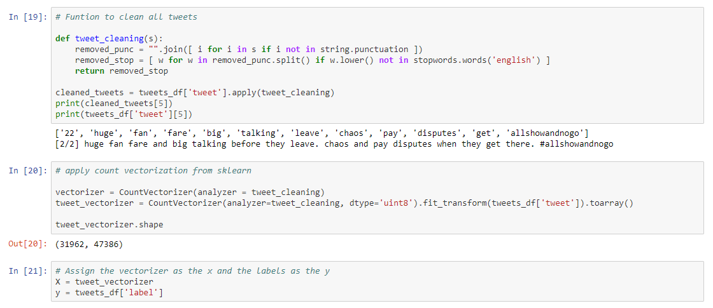
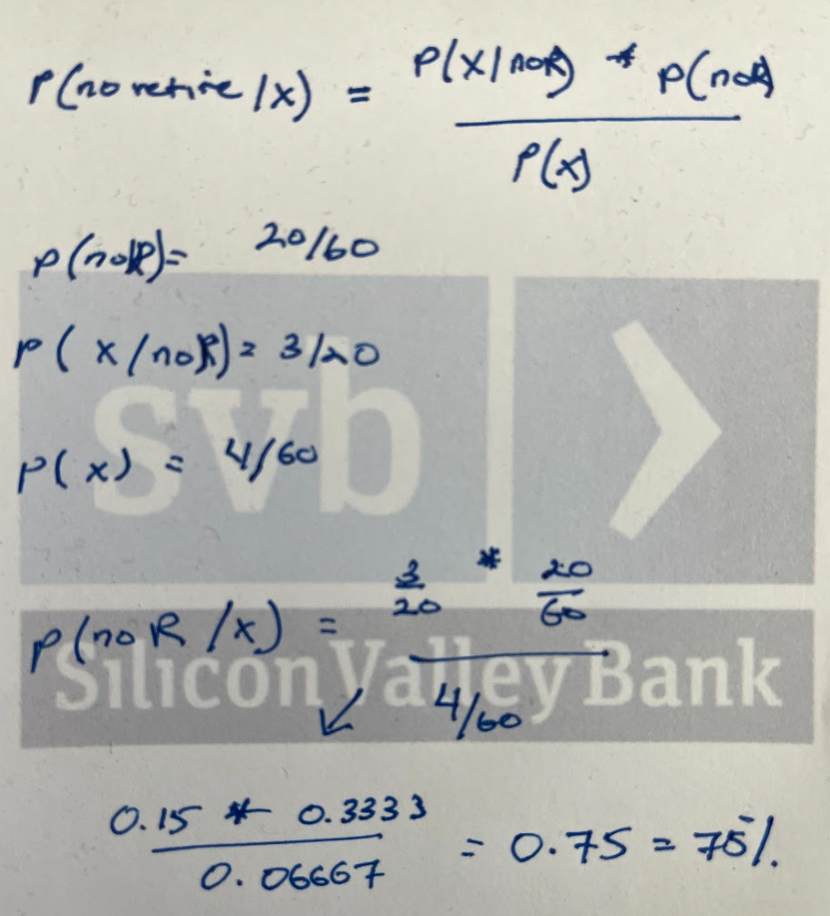
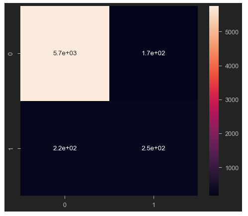
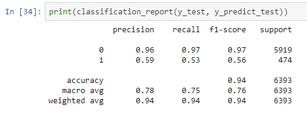

# NLP Sentiment Analysis Guide

A repository of lessons I learned from a course on [Natural Language Processing by Coursera](https://www.coursera.org/learn/twitter-sentiment-analysis/home/welcome), specifically on sentiment analysis.

This was an introductory machine learning course. I was interested in this because I had never built a model that was centerred around Natural Language Processing. As a new experience, I wanted to know how industry experts would use human languages/words to train a computer to identify things like good and bad reviews.

If you are interested in the lessons taught in this course, you may look below for an overview, or click [here to to view the entire notebook](https://nbviewer.jupyter.org/github/gianmillare/NLP-Sentiment-Analysis-Guide/blob/main/NLP_Sentiment.ipynb). Enjoy!

Data Snapshot: A database full of tweets consisting of positive tweets (labeled 0) and a subset of negative tweets (labeled 1).

Process 1: I wanted to visualize the words found in good and bad tweets. Below shows the distribution of positive tweets.

... And here is a visualization of the distribution of negative tweets.

Process 2: Data Cleaning. I used string.punctuation to remove punctuations, and nltk.stopwords to remove unnecessary words. Tokenization was used to vectorize the final subset of words.

Process 3: I learned how to calculate Naive Bayesian Models. At a high level overview, Posterior Probability is calculated by taking components of Prior Probability and Likelihood. The notes on Naive Bayes is in the [notebook](https://nbviewer.jupyter.org/github/gianmillare/NLP-Sentiment-Analysis-Guide/blob/main/NLP_Sentiment.ipynb). Below is an image of my handwritten challenge to find probability of non-eligible retirees (example). This concept is then applied to the rest of the project.

Process 4: I use a Confusion Matric to validate my model before using a Classification Report. The summary of the Confusion Matrix is in the [notebook](https://nbviewer.jupyter.org/github/gianmillare/NLP-Sentiment-Analysis-Guide/blob/main/NLP_Sentiment.ipynb), below is an image of the results:

Lastly: Below is the Classification Report. Although this was a short project, It definitely gave me exposure to the world of Natural Language Processing. Love it!

